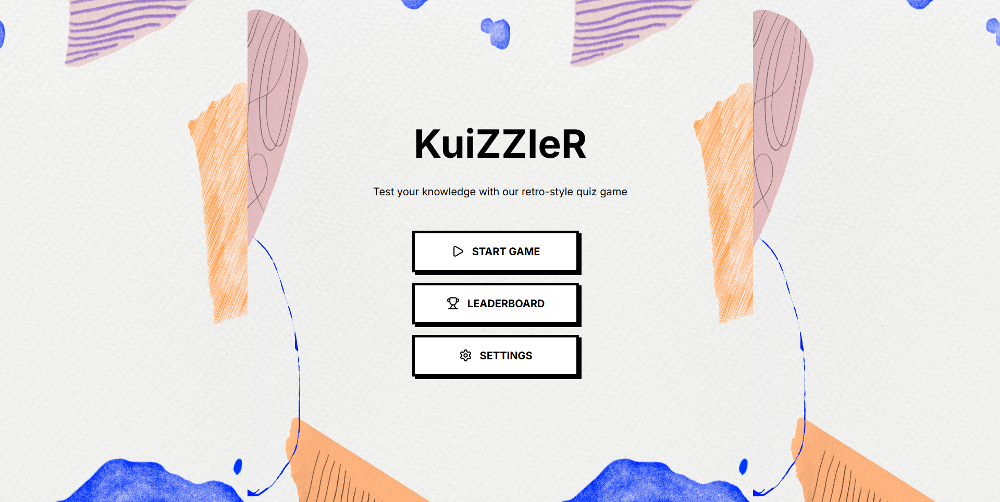
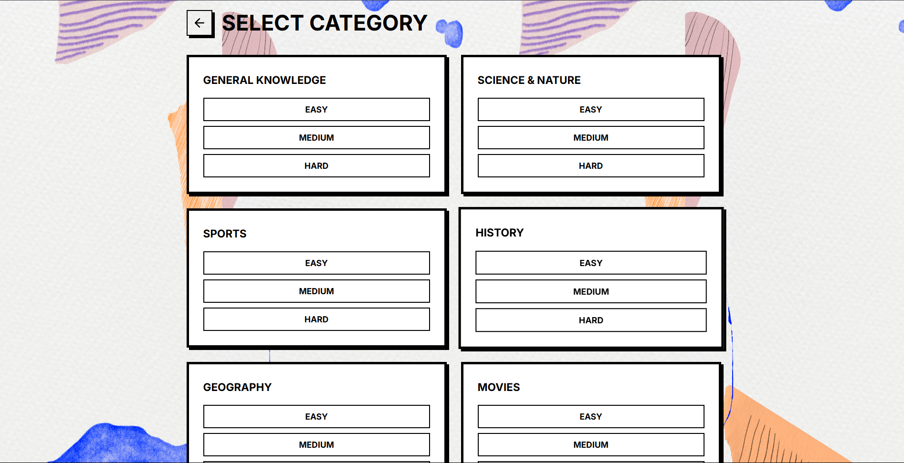
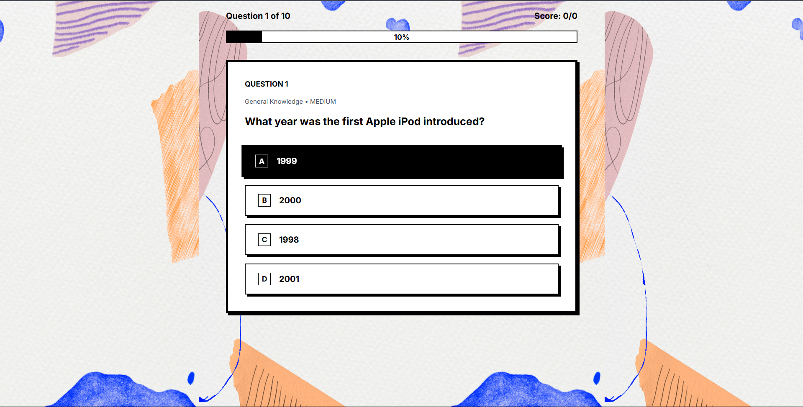
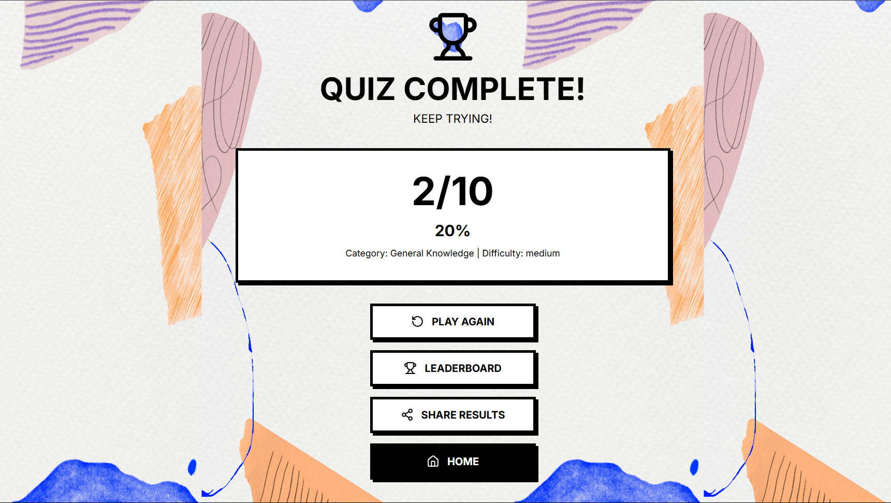

# KuiZZleR 🧠

A fun and interactive quiz website built with Next.js, featuring trivia questions from various categories to test your knowledge!

## 📋 Overview

KuiZZleR is a modern quiz application that challenges users with trivia questions across multiple categories and difficulty levels. Built with performance and user experience in mind, it provides an engaging platform for knowledge testing and learning. The app fetches questions dynamically from the Open Trivia Database API, ensuring fresh content for every quiz session.

Whether you're looking to test your general knowledge, learn something new, or just have fun with friends, KuiZZleR offers an intuitive and responsive quiz experience that works seamlessly across all devices.

## 🚀 Live Demo

🔗 **[Try KuiZZleR Now](https://kui-z-zle-r.vercel.app/)**

## 🛠️ Technologies Used

### Frontend Framework
- **Next.js** - React framework for production-ready applications
- **React.js** - Component-based user interface library

### Styling
- **Tailwind CSS** - Utility-first CSS framework for rapid UI development

### API Integration
- **Open Trivia Database API** - External API for trivia questions
- **Fetch API** - Built-in JavaScript API for HTTP requests

### Additional Features
- **Next.js API Routes** - Server-side API handling
- **Responsive Design** - Mobile-first approach
- **Dynamic Routing** - Client-side navigation
- **State Management** - React hooks for local state

## 📸 Screenshots

### Homepage

> Clean and welcoming homepage with quiz category selection

### Quiz Selection

> Choose your preferred category and difficulty level

### Quiz Interface

> Interactive quiz interface with multiple choice questions

### Results Page

> Score summary and performance breakdown

---

⭐ Star this repo if you enjoyed the quiz experience!